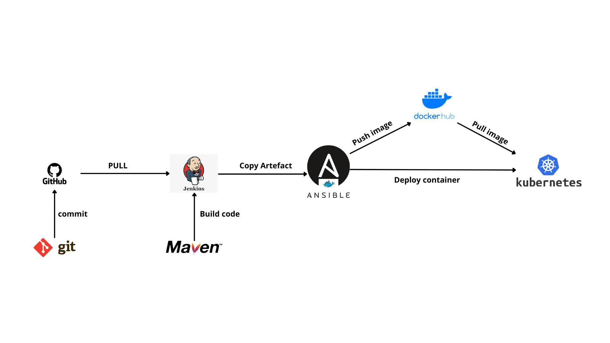

**Étapes de configuration manuelle dans Jenkins pour la partie integration continue pour `myP1_CI_Job` :**

 (Freestyle Project)

1. **Créer un nouveau job** :
   - Allez à Jenkins -> New Item.
   - Entrez le nom du job : **myP1_CI_Job**.
   - Sélectionnez **Freestyle Project**.
   - Cliquez sur **OK**.

2. **Configuration du projet** :
   - **Description** : `Build code with help of maven and create an image on ansible and push onto dockerhub`.
   - **Source Code Managdement** :
     - **Repository URL** : `https://github.com/rafik6112/CI-CD-DevOps-Pipeline-Project`.
     - **Branch Specifier** : `*/master`.

3. **Build** :
   - Dans la section **Build**, cliquez sur **Add build step** -> **Invoke top-level Maven targets**.
   - **Root POM** : `pom.xml`.
   - **Goals and Options** : `clean install`.

4. **Post-build Actions** :
   - **Send build artifacts over SSH** :
     - **Name** : `ansible-server`.
     - **Source files** : `webapp/target/*.war`.
     - **Remove prefix** : `webapp/target`.
     - **Remote directory** : `/opt/target`.
     - **Exec command** : `ansible-playbook /opt/docker/create_image_myimageraf.yml`.

5. **Post-build Actions** :
   - Cliquez sur **Add post-build action** -> **Build other projects**.
   - Entrez `myP1_CD_Job`.
   - Sélectionnez **Trigger only if build is stable**.

Étapes de configuration manuelle dans Jenkins pour la livraison continue pour `myP1_CD_Job` :**

 (Freestyle Project)

1. **Créer un nouveau job** :
   - Allez à Jenkins -> New Item.
   - Entrez le nom du job : **myP1_CD_Job**.
   - Sélectionnez **Freestyle Project**.
   - Cliquez sur **OK**.
  

  ## Étapes de configuration manuelle pour le Monitoring avec Prometheus/Grafana:

 Installation de Prometheus et Grafana via Helm

- Ajoutez le dépôt Helm de Prometheus et mise à jour avec les commandes suivantes :

          helm repo add prometheus-community https://prometheus-community.github.io/helm-charts
          helm repo update**
	
   - Installation de Prometheus et Grafana
	
     Création d'un fichier custom-values.yaml avec les configurations suivantes pour exposer Prometheus et Grafana via des NodePorts.
	Ensuite, installez le chart Helm avec la commande suivante :
	
         helm upgrade --install kube-prometheus-stack prometheus-community/kube-prometheus-stack -f custom-values.yaml
	
  - Accès à Prometheus et Grafana

    Pour accéder à Prometheus et Grafana, suivez ces étapes :

  - Obtenir l'IP externe de vos nœuds avec :

        kubectl get services
   

Utilisez les adresses suivantes pour accéder à Prometheus et Grafana :

Prometheus : http://<IP_EXTERNE>:30090/

Grafana : http://192.168.49.2:31170/

On peut paramétrer les alertes dans Prometheus comme dans ce qui suit.

Avoir accès aux tableaux de bord.

 

# CI-CD-DevOps-Pipeline-Project
